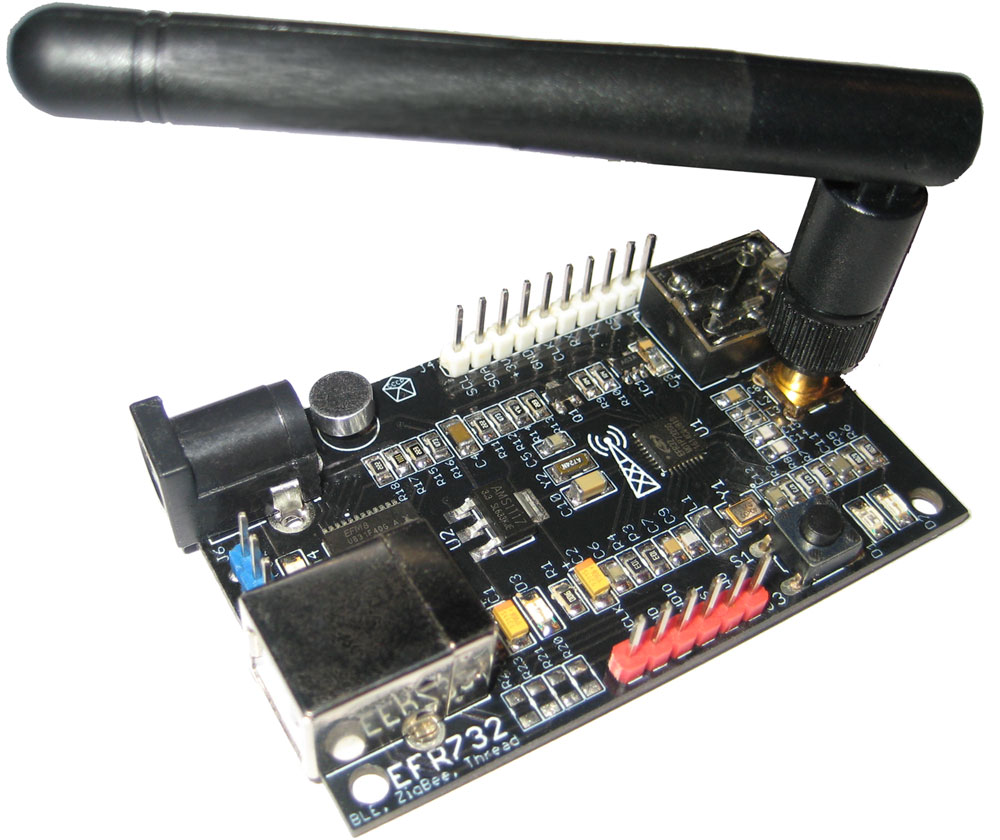

# EFR732-Bluetooth
EFR732 - is a multi-protocol radio board based on the [EFR32MG1P732F256GM32 @40MHz MCU](https://www.silabs.com/wireless/zigbee/efr32mg1-series-1-socs/device.efr32mg1p732f256gm32) from SiliconLabs in QFN32 package. Now this is MCU is announced as deprecated. :-(

This MCU supports:
* Bluetooth Smart (BLE),
* ZigBee,
* Thread,
* Proprietary protocols.

Maximum TX Power is: 2.4 GHz @ 19.5 dBm, Antenna in the SMA connector adds +3dBm.
This MCU integrate a 512kB serial flash in the package.

### Key features:
 - The board has JTAG/SWD pins compatible with the J-Link debug adapter (PF0 - SWCLK, PF1 - SWDIO, PF2 - SWO).
 - The on-board microphone with the amplifier is connected to the MCU ADC port (PB13).
 - The iDAC output is amplified with the LM321 (PB12).
 - There is a USB-to-UART bridge based on the [EFM8UB31F40 MCU](https://www.silabs.com/mcu/8-bit/efm8-universal-bee/device.efm8ub31f40g-qsop24) : P04_TX -> PA1_RX, P05_RX -> PA0_TX. I hope this 8051 MCU can be used as a programmer/debugger someday.
 - Two pins are connected: P03 -> PB11 (clk), P06 -> PD13 (cs). Debug pins are not connected yet.
 - User push-button is connected to PF3.

The [`Hardware`](Hardware) folder contains Eagle CAD 9.0 schematics files. Component library can be found in my repositories.
The board schematics can be found in the[`Hardware/EFR732.png`](Hardware/EFR732.png) file.

